## Aim

Build a molecular species phylogeny using orthologues identified from an orthology database.

## Learning outcomes

* What is needed as input to build a molecular species phylogeny?
* How do we have confidence in such a species tree?

## Collecting input data from an orthology database

{ style="float: right;" }

There are many publicly accessible orthology databases, or tools that can be used to delineate orthology with your own datasets. Today, we will use data from [OrthoDB](https://www.orthodb.org/). OrthoDB is part of the [SwissOrthology](https://swissorthology.ch/service/search) resource.

From your browser, search for orthodb.org or go to [https://www.orthodb.org/](https://www.orthodb.org/). We will use the OrthoDB website to select our species/clade of interest and query the database to retrieve orthologous groups that we can use to build a species tree.

<figure>
  
  <figcaption>OrthoDB v11 homepage</figcaption>
</figure>

Because the beetles are wonderful, we will use them as the example group for exploring the orthology data and building our molecular species tree. We will therefore used the  navigation tool of OrthoDB to narrow our search to available beetle species (Coleoptera): Eukaryota ⇒ Metazoa ⇒ Arthropoda ⇒ Hexapoda ⇒ Insecta ⇒ Holometabola ⇒ Coleoptera.

<figure>
  
</figure>

The `Search at:` and `Species to display:` boxes should be automatically updated now to show "Coleoptera" and "all 15 selected". Click `Submit` with no search terms to first retrieve all orthologous groups delineated across these 15 species of beetles.

<figure>
  
</figure>

For the orthologous groups returned by the query, summary information is displayed:

* Orthologous group names/descriptions (if available)
* Counts of genes and species per orthologous group

<figure>
  
</figure>

**Question: How many groups in total are returned? What kinds of orthologous groups would we need to find if we want to build a species tree, and why?**

??? done "Answer"
    **14753 groups** are returned. However, it is best to use **single-copy orthologues** to build a species tree, because they easily allow to calculate the exact evolutionary distance between sequences. Using multi-copy orthologues drastically complicates things as you cannot be sure of the homology relationships between all the genes (orthology vs paralogy).

We can use the `Advanced` navigation tool of OrthoDB to narrow our search for orthologous groups that will be useful for building a species phylogeny. Using the "Phyloprofile" filter we can ask the query to return only orthologous groups that are "Present in all species" and that are "Single-copy in all species". Click `Submit` with no search terms to retrieve all orthologous groups delineated across these 15 species of beetle, now with the phyloprofile filtered set.

<figure>
  
</figure>

!!! note
    [Direct URL](https://www.orthodb.org/?universal=1&level=7041&species=7041&singlecopy=1) in case the search with filters did not work properly for you.

<figure>
  
  <figcaption>Results of the filtered query</figcaption>
</figure>

**Question: Did the filtering work - how do you know? How many groups in total are now returned? Why are there so few groups compared to the last query that returned all orthologous 14’753 groups?**

??? done "Answer"
    The filtering worked: we now have only **1225 groups**, all composed of 1 gene per species. The previous query returned more results because a lot of groups contained genes in several but not all species, and these groups were filtered out during this search.

Explore some specific results of your query, _e.g._ the ones for group [10000at7041](https://www.orthodb.org/?level=7041&species=7041&query=10000at7041) described as "phosphatidylinositol 4-kinase beta".

* The **Group hierarchy** view allows navigating back up the tree of life to the metazoan last common ancestor

<figure>
  
</figure>

* **Functional descriptions** list Gene Ontology (GO) terms and InterPro domains that have been mapped to genes belonging to this orthologous group. They provide clues as to the likely function of all genes in the orthologous group

<figure>
  
</figure>

* **Evolutionary descriptions** summarise the group’s phyletic profile, its relative rate of protein sequence divergence, and the "average" gene architecture (structure in terms of introns and exons and total length in amino acids)

<figure>
  
</figure>

Expand the **Orthologs by organism** table to view members of this orthologous group.

<figure>
  
</figure>

**Questions:**

* **What is the average length (AAs) of these proteins? Are there any substantially longer or shorter proteins than the average?**
* **Why might some be rather different from the average? What impacts could this have when it comes to using these sequences for building a phylogeny?**

??? done "Answer"
    The average length of these proteins is ~930 AAs. There are no substantially longer proteins, but we can notice much shorter proteins (349 AAs, 613 AAs...) that are displayed with one or two exclamation marks `!` depending on the length difference. These short proteins might be real but more likely, they indicate an annotation problem (for example a case of automatic annotation that did not pick-up the full length protein). These proteins can severely impact species tree creation because they will cause a bias in the multiple alignment step.

Additional information about each gene can be viewed by clicking on the chevron buttons `>` or `>>`, _e.g._ for the _Tribolium castaneum_ orthologue.

<figure>
  
</figure>

Before we download any genomics data, let’s create a working directory for this exercise, starting by opening a terminal on the Workspace if you’ve not already got one open. Then, from the `/workspace/biodivinfo/` directory, create a new directory (`mkdir`) and navigate into the new directory (`cd`):

```
cd /workspace/biodivinfo/
mkdir Session2
cd Session2/
```

<figure>
  
</figure>

To build a phylogeny we need to download the sequences: on the top right of each orthologous group view you can access the protein sequences using "View Fasta".

<figure>
  
</figure>

A new tab will open displaying the protein sequences, copy the URL of the page so we can use it to download the sequences directly in the next step.

<figure>
  
</figure>

Now fetch the fasta formatted sequences from OrthoDB from the command line using `curl`, give the downloaded fasta data a filename (-o) using the orthologous group ID "10000at7041.fasta" and make sure that the URL is placed inside quotes:
```
curl -o 10000at7041.fasta "https://data.orthodb.org/v11/fasta?id=10000at7041&species=7041"
```

<figure>
  
</figure>

If fetching from OrthoDB failed, you can get the file from the folder with data files for the practical instead:
```
cp /workspace/biodivinfo/data/Session2/10000at7041.fasta .
```

Use the file explorer on the Workspace to view the downloaded fasta file

<figure>
  
</figure>

We need to replace the **colon** "\_0:" in the protein identifiers with an underscore "\_0\_" because some downstream tools do not accept colons in identifiers. We will perform such **replacement** using the command line function `sed`:
```
sed -i 's/_0:/_0_/g' 10000at7041.fasta
```

<figure>
  
  <figcaption>Note how there are now no longer any colons in the identifiers</figcaption>
</figure>

## Building a tree from single-copy orthologues

There are many different software tools available for sequence alignment and phylogenetics, the logic however remains basically the same no matter the software, we need to:

* Align all the protein sequences as a multiple sequence alignment: we use MAFFT
* Filter/trim the alignment to keep only well-aligned regions: we use TrimAl
* Use the filtered alignment to build a molecular phylogeny: we use RAxML

### Multiple sequence alignment using MAFFT

The basic [command](https://mafft.cbrc.jp/alignment/software/) for running MAFFT is:

<figure>
  
</figure>

We can run MAFFT in the "quiet" mode to avoid progress reports (`--quiet`). We can proceed to build the alignment from the command line as follows, naming the output alignment file appropriately by adding `.aln.` to the output filename:
```
mafft --quiet --auto 10000at7041.fasta > 10000at7041.aln.fasta
```

Use the file explorer on the Workspace to open the multiple sequence alignment file.

<figure>
  
</figure>

If MAFFT did not work you can get the file from the folder instead:
```
cp /workspace/biodivinfo/data/Session2/10000at7041.aln.fasta .
```

You might otherwise use your favourite alignment viewer (_e.g._ [JalView](https://www.jalview.org/)) for a more colourful and meaningful visualisation. To download the file from the Workspace, find the file in the explorer, right-click on the file, and select `Download`.

<figure>
  
</figure>

Here is an example of the JalView visualisation.

<figure>
  
  <figcaption>First ~200 columns of the alignment</figcaption>
</figure>

<figure>
  
  <figcaption>Last ~200 columns of the alignment</figcaption>
</figure>

**Questions:**

* **From the two visualisations above showing the start and then the end of the alignment - which end seems more complete and well-aligned?**
* **What do you think an alignment region would need to have in order to be most useful for reconstructing the phylogeny, and why?**

??? done "Answer"
    The end of the alignment seems more complete and well-aligned. To reconstruct the phylogeny, an alignment region should not have too many mutations: if there are no common regions between the proteins, they will be impossible to align to each other and it will impossible to build the phylogeny. On the other hand, an alignment without mutations should also be avoided because it contains no signal to discriminate between species.

### Filter/trim using TrimAl

We could manually go through the multiple sequence alignment and select regions that we think would be the best to use for building the phylogeny - but this is very subjective and not at all reproducible. Therefore there are several tools designed to help select "useful" regions from multiple sequence alignments and extract them to use for subsequent tree building steps. The basic [command](http://trimal.cgenomics.org/use_of_the_command_line_trimal_v1.2) for running TrimAl is:

<figure>
  
</figure>


TrimAl has many parameters that one can tune depending on your input dataset, as well as a few "default" options such as:

* `-nogaps`: remove all positions with gaps in the alignment
* `-strict`: use automatic selection on "strict" mode
* `-automated1`: use a heuristic selection of the automatic method based on similarity statistics

Here we will use the `-automated1` option, a heuristic approach that selects the best automatic method to trim a given alignment, and is optimised for trimming alignments that will be analysed by Maximum Likelihood phylogenetic analyses. The output filename we will label with `.trm.` _i.e._ after trimming has been performed. We will also ask TrimAl to print out an HTML output to visualise the regions selected and rejected from the input full alignment:
```
trimal -in 10000at7041.aln.fasta -out 10000at7041.aln.trm.fasta -automated1 -htmlout 10000at7041.aln.trm.html
```

<figure>
  
</figure>

You can now download (same as how you downloaded the alignment before trimming) and open **10000at7041.aln.trm.html** (_e.g._ Firefox or another browser) to view the results.

If trimAl did not work you can get the files from the folder instead:
```
cp /workspace/biodivinfo/data/Session2/10000at7041.aln.trm.fasta .
cp /workspace/biodivinfo/data/Session2/10000at7041.aln.trm.html .
```

TrimAl’s [HTML output](https://glcdn.githack.com/evogenlab/teaching-repos/biodivinfo/raw/main/data/Session2/10000at7041.aln.trm.html) shows the regions selected (`Selected Cols:` highlighted in grey) and the regions rejected during the filtering process.

<figure>
  
</figure>

### Phylogeny building using RAxML

We will now use the filtered alignment as input to [RAxML](https://cme.h-its.org/exelixis/web/software/raxml/) to build a Maximum Likelihood phylogeny. Because we have single-copy orthologues - one from each of our 15 beetle species - we can have some expectation that this gene tree would represent the species tree.

For reference: species names from their taxonomic identifiers (from OrthoDB):

| OrthoDB taxonomic identifiers   | Species name                  | Beautiful beetles                                                       |
|-------------------------------  |-----------------------------  |------------------------------------------------------------------------ |
| 110193_0                        | _Nicrophorus vespilloides_    | 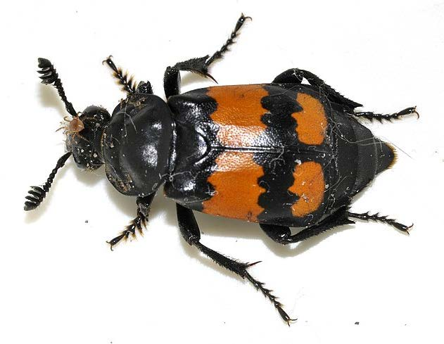{width=75}   |
| 115357_0                        | _Harmonia axyridis_           | 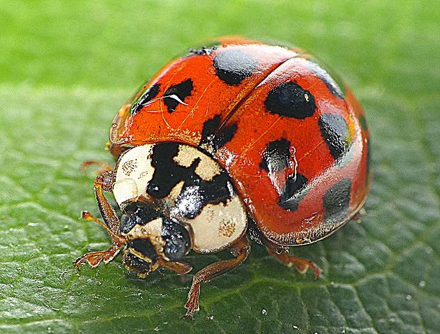{width=75}   |
| 116153_0                        | _Aethina tumida_              | 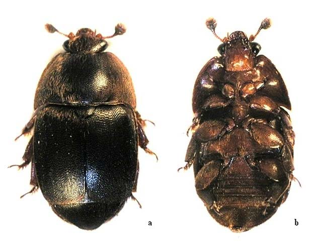{width=75}   |
| 1629725_0                       | _Oryctes borbonicus_          | 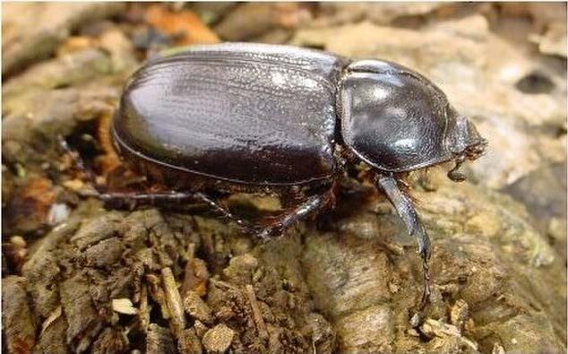{width=75}  |
| 166361_0                        | _Onthophagus taurus_          | {width=75}   |
| 217634_0                        | _Anoplophora glabripennis_    | {width=75}   |
| 224129_0                        | _Agrilus planipennis_         | {width=75}   |
| 41139_0                         | _Coccinella septempunctata_   | 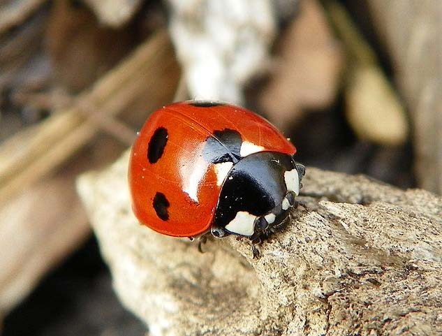{width=75}    |
| 41895_0                         | _Tribolium madens_            | {width=75}    |
| 50390_0                         | _Diabrotica virgifera_        | 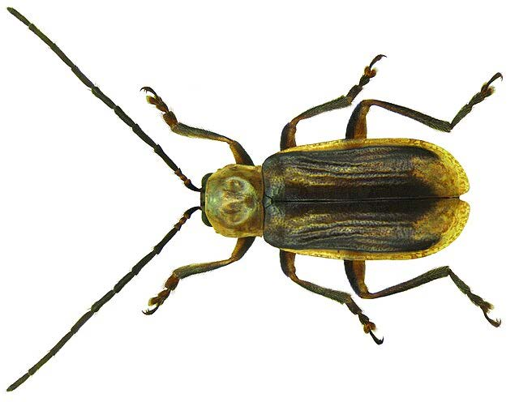{width=75}    |
| 7048_0                          | _Sitophilus oryzae_           | 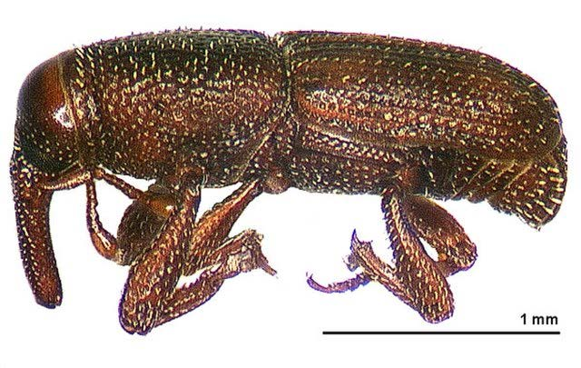{width=75}     |
| 7054_0                          | _Photinus pyralis_            | 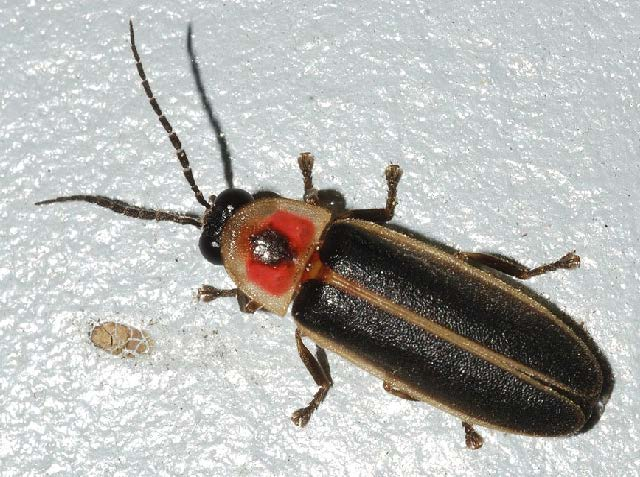{width=75}     |
| 7070_0                          | _Tribolium castaneum_         | 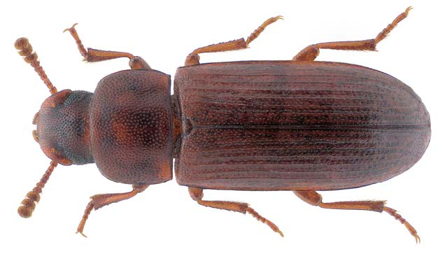{width=75}     |
| 7539_0                          | _Leptinotarsa decemlineata_   | 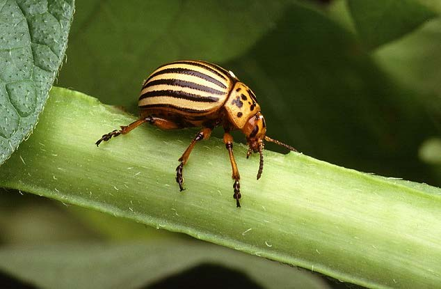{width=75}     |
| 77166_0                         | _Dendroctonus ponderosae_     | 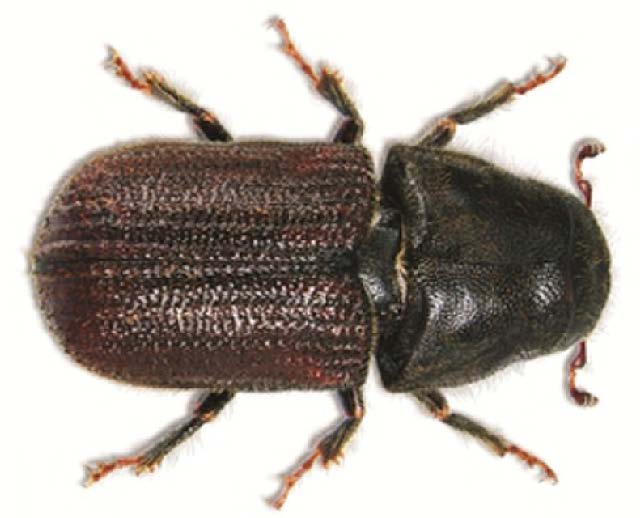{width=75}    |

RAxML has many options! View the summary of parameters/options using the `-h` flag, for the full explanations you’ll need to check out the RAxML manual later:
```
raxmlHPC-SSE3 -h | more
```

<figure>
  
</figure>

The three main required input options are:

* `-s sequenceFileName`: your filtered alignment file
* `-n outputFileName`: the name you want to give the output files
* `-m substitutionModel`: the substitution model you want RAxML to use

Phylogeny estimation using protein sequences requires the selection of a **protein substitution model**. Divergence among sequences can be modelled with a matrix that describes probabilities of **amino acid substitutions** (mutations that cause one amino acid to be replaced by another). This corresponds to a model of evolution in which amino acids mutate randomly and independently from one another but according to some **predefined probabilities** depending on the properties of the amino acid itself.

<figure>
  
</figure>

We will use the **JTT** (Jones-Taylor-Thornton) with the **GAMMA** model of rate heterogeneity: `PROTGAMMAJTT`. For speed in the class we will also specify that RAxML should use its rapid bootstrap algorithm to conduct a rapid bootstrap analysis and search for the best-scoring ML tree in one single programme run: `-f a`, we also need to indicate how many bootstraps RAxML should perform: `-N 10` (normally many more, but for the class we will perform only 10 samples). For reproducibility of the optimisation steps, RAxML additionally requires us to define the random starting seed for parsimony _e.g._ `-p 12345` and for the subsequent ML search _e.g._ `-x 12345`.

Launch RAxML with the options defined for a rapid bootstrap & ML analysis:
```
raxmlHPC-SSE3 -s 10000at7041.aln.trm.fasta -f a -N 10 -p 12345 -x 12345 -m PROTGAMMAJTT -n 10000at7041
```

RAxML should take less than 2 minutes to estimate the phylogeny with 10 bootstrap samples, printing the progress log to the terminal.

<figure>
  
</figure>

**Question: What is "bootstrap analysis" and why would we be interested in running it?**

??? done "Answer"
    Bootstrapping is a type of test that uses random sampling with replacement (resampling methods) - it uses sampling with replacement to assess the reliability of sequence-based phylogenies. Bootstrap values in a phylogenetic tree indicate how many times the same branch is observed when repeating the generation of a phylogenetic tree on a resampled set of data and thus give information about the stability of the tree structure (_i.e._ the branching order). In bootstrap resampling, we generate artificial sequences by randomly sampling sites of the original sequences with replacement to produce a different composition of the data with the same sequence length as the original alignment.

<figure>
  
</figure>

If RAxML did not work you can get the files from the folder instead:
```
cp /workspace/biodivinfo/data/Session2/RAxML_bestTree.10000at7041 .
cp /workspace/biodivinfo/data/Session2/RAxML_bipartitions.10000at7041 .
cp /workspace/biodivinfo/data/Session2/RAxML_bipartitionsBranchLabels.10000at7041 .
cp /workspace/biodivinfo/data/Session2/RAxML_bootstrap.10000at7041 .
cp /workspace/biodivinfo/data/Session2/RAxML_info.10000at7041 .
```

RAxML output:

* \_bestTree: best-supported phylogeny
* \_bipartitions: best tree with bootstrap results on nodes
* \_bipartitionsBranchLabels: best tree with bootstrap results on branches
* \_bootstrap: tree from each bootstrap sample
* \_info: information on the analysis performed

{ style="float: top;" }

Now we will visualise the results: the phylogenetic tree. Open the "bipartitions" file (`RAxML_bipartitions.10000at7041`) and copy the contents (the newick-format tree).

<figure>
  
</figure>

In your browser go to the **iTOL Interactive Tree Of Life** [website](https://itol.embl.de/) and open the `Upload` page from the main navigation bar.

<figure>
  
</figure>

Enter a `Tree name`, e.g. `tree1`. Paste the RAxML result bipartitions tree into the `Tree text:` box. Click `Upload` to load your tree onto the iTOL platform.

<figure>
  
</figure>

By default, your tree should be displayed similarly to this one:

<figure>
  
</figure>

Use the `Control Panel` on the right of the tree to select the `Advanced` tab and choose to display `Bootstraps` as `Text`.

<figure>
  
</figure>

If you did not manage to visualise the tree, you can find it on gitpod at:
```
/workspace/biodivinfo/data/Session2/tree_10000at7041.jpg
```
Or you can directly see it [here](https://gitlab.com/evogenlab/teaching-repos/biodivinfo/-/blob/main/data/Session2/tree_10000at7041.jpg).

**Questions:**

* **Why would some nodes obtain 100% bootstrap support while others are weaker and others are very low indeed?**
* **How can we know if our "species tree", made from just one single-copy orthologous group, reflects the reality of these species’ evolutionary relationships?**
* **What would we need to do next in order to improve the confidence in our molecular "species phylogeny"?**

??? done "Answer"
    * Some nodes are very stable and do not change during bootstrap while others do. These weakers nodes indicate that the branching varies and may not be an accurate representation of the species tree
    * We can compare the tree with what is known in the literature. Alternatively, we can compare this tree with species tree made from other single-copy orthologous groups. If all the trees concur, this is a very strong indicator of the species’ evolutionary relationships
    * Create trees from other single-copy orthologous groups and reconcile them with a tree from the literature if it exists.
